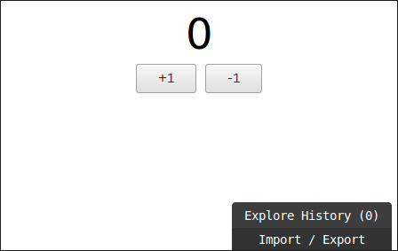
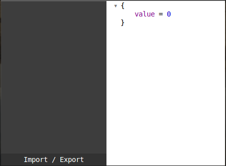
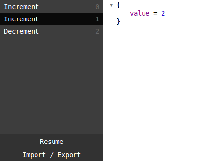
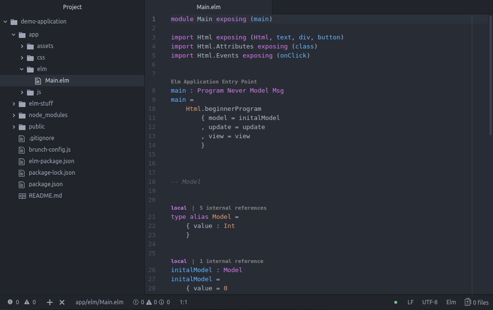
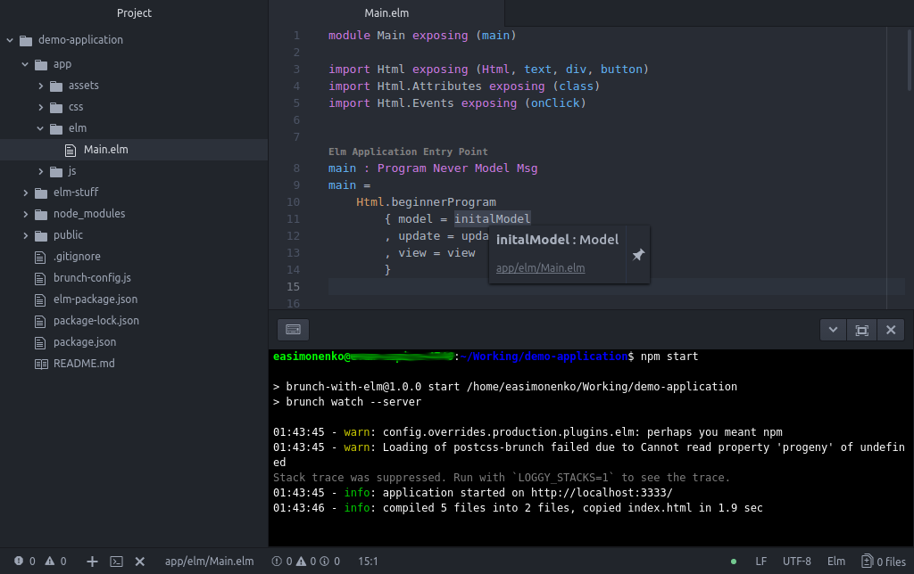
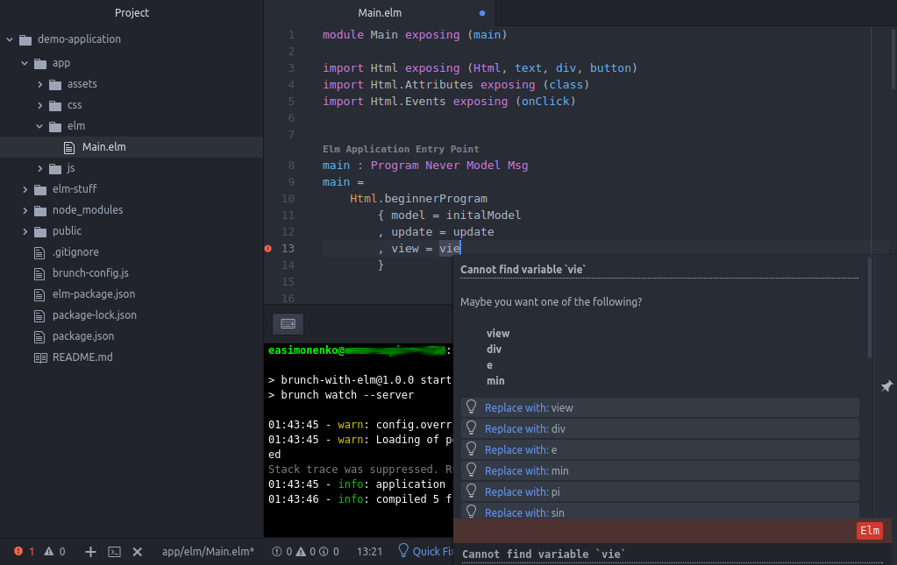

# Инструменты разработчика на языке Elm

_Эта статья в немного другой редакции была первоначально опубликована на
[Habrahabr](https://habrahabr.ru/post/347730/) (29 января 2018) , а затем в
[блоге автора](https://easimonenko.github.io/#!/blog/developers-tools-in-the-elm-language-2018)._

С момента публикации статьи
[Основы разработки на языке Elm (руководство по инструментарию для начинающих)](/#!/blog/developers-tools-in-the-elm-language)
прошло полтора года. За это время в инструментарии для языка разработки
веб-интерфейсов [Elm](http://elm-lang.org/) произошли
многочисленные изменения: появилась более удобная система сборки с возможностью
генерации нового проекта; для редактора Atom набор дополнений в некоторых
отношениях теперь лучше, чем для популярного тогда среди разработчиков на Elm
редактора LightTable; заработал инспектор состояния приложения. Давайте
пройдёмся по этому набору на простом примере.


## Базовые средства Elm

Elm можно установить как пакет NPM:

``` bash
npm install -g elm
```

Есть и другие способы установить Elm. Они описываются в
[официальном руководстве](https://guide.elm-lang.org/install.html).

Проверим версию только что установленного Elm:

``` sh
elm --version
```

``` plain
0.18.0
```

`elm` является обёрткой для вызова отдельных утилит:

- `elm-make`: сборка кода на Elm;
- `elm-package`: управление пакетами на Elm;
- `elm-reactor`: утилита слежения за кодом на Elm для перекомпиляции и
  перезагрузки его в браузере;
- `elm-repl`: REPL для Elm.

## Управление кодом на Elm с помощью Brunch

Одним из удобнейших средств управления кодом на Elm представляется
[Brunch](http://brunch.io/). Устанавливается Brunch как пакет NPM:

``` sh
npm install -g brunch
```

Проверим версию только что установленного Brunch:

``` sh
brunch --version
```

``` plain
2.10.12
```

Вызовем Brunch для генерации кода нашего примера проекта на Elm:

``` sh
brunch new --skeleton MattCheely/elm-brunch-skeleton demo-application
```

После генерации кода Brunch также сразу загрузит все необходимые NPM- и
Elm-пакеты.

Рассмотрим сгенерированное дерево каталогов:

- `app\`: исходные тексты приложения
  - `assets\`:
    - `index.html`: минимальный документ HTML5, который будет контейнером для
      нашего приложения
  - `css\`:
    - `style.css`: стили для примера приложения
  - `elm\`: исходные тексты на Elm
    - `Main.elm`: главный модуль приложения на Elm
  - `js\`: код на JavaScript
    - `app.js`: пример кода, работающего отдельно от кода на Elm
- `elm-stuff\`: загруженные пакеты на Elm
- `node_modules\`: загруженные NPM-пакеты
- `.gitignore`
- `README.md`
- `brunch-config.js`: настройки для Brunch с учётом поддержки Elm
- `elm-packages.json`: настройки для Elm, в том числе список используемых
  пакетов
- `package-lock.json`: список зависимостей NPM (сгенерирован NPM автоматически)
- `package.json`: настройки для NPM

Уже сейчас мы можем собрать наш проект:

``` sh
cd demo-application
npm build
```

После сборки проекта появится также папка `public`, в которой разместятся все
части нашего веб-приложения.

Давайте запустим приложение в режиме отладки:

``` sh
npm start
```

Откроем в браузере ссылку `http://localhost:3333/` и полюбуемся на прекрасное
веб-приложение:



В правом нижнем углу находится интерфейс инспектора состояния приложения.
Щёлкнем на нём. Сейчас счётчик `value` имеет значение `0`:



Пощёлкаем на кнопках `+1` и `-1` и понаблюдаем как меняется состояние:


Мы можем вернуться к любому предыдущему состоянию:



И даже вернуться к последнему, просто нажав на кнопку `Resume`.

Неискушённому ~~зрителю~~ читателю наверное будет интересно также узнать, как
устроено приложение на Elm, но сначала давайте настроим редактор, чтобы
изучать исходный код приложения было приятней и удобней.

## Настройка Atom для работы с Elm

Поддержка разработки на Elm есть для многих редакторов, однако здесь мы
рассмотрим только один, [Atom](https://atom.io/), так как на взгляд автора для
него существует самый функциональный набор дополнений, облегчающий работу с Elm.
Будем исходить из того, что Atom у вас уже установлен (хотя, подскажу откуда его
можно загрузить: <https://github.com/atom/atom/releases>).

Перво наперво установим дополнение
[language-elm](https://atom.io/packages/language-elm):

``` sh
apm install language-elm
```

Это дополнение предоставит базовую поддержку Elm, такую как синтаксическая
подсветка кода.

Для поддержки переходов к определениям и всплывающим подсказкам с типами
выражений установим пакет [atom-ide-ui](https://atom.io/packages/atom-ide-ui).

``` sh
apm install atom-ide-ui
```

Для поддержки автодополнения поставим
[autocomplete-plus](https://atom.io/packages/autocomplete-plus):

``` sh
apm install autocomplete-plus
```

Если используете сокращённый набор кода, поставьте
[snippets](https://atom.io/packages/snippets):

``` sh
apm install snippets
```

Наконец мы готовы установить
[Elmjutsu](https://github.com/halohalospecial/atom-elmjutsu):

``` sh
apm install elmjutsu
```

Теперь мы можем открыть наш проект в Atom:



Для руководства по настройке и функциям Elmjutsu обязательно зайдите на
страничку этого дополнения, и не забудьте задать все необходимые параметры в
Atom.

## Дополнительный, но важный инструментарий

Пожалуй самый важный инструмент из дополнительных это
[elm-format](https://github.com/avh4/elm-format). С помощью этой утилиты
можно приводить внешний вид программы к стандартному (общепринятому) виду.
Установим его:

``` sh
npm install -g elm-format
```

Также установим соответствующее дополнение для Atom
[elm-format](https://atom.io/packages/elm-format):

``` sh
apm install elm-format
```

Благодаря этому дополнению, каждый раз, как мы будем сохранять наш код,
elm-format будет его форматировать. Если в коде будет синтаксическая ошибка, то
утилита её обнаружит, и мы об этом узнаем, хотя, для выяснения наличия ошибок
всё же лучше использовать компилятор. А в этом нам будет помогать дополнение для
Atom [linter-elm-make](https://atom.io/packages/linter-elm-make).

Поставим его:

``` sh
apm install linter
apm install linter-elm-make
```

Не забудьте также зайти в настройки этих дополнений и задать все необходимые
параметры.

Дополнение [elm-lens](https://atom.io/packages/elm-lens) показывает прямо в коде
для функций и типов экспонируются ли они или являются локальными, а также
сколько раз на них ссылаются. Для установки дополнения просто вызовите:

``` sh
apm install elm-lens
```

Для поддержки REPL в Atom можно установить дополнение
[elm-instant](https://atom.io/packages/elm-instant):

``` sh
apm install elm-instant
```

Если вы хотите работать с терминалом прямо в Atom, рекомендую установить
дополнение [platformio-ide-terminal](https://atom.io/packages/platformio-ide-terminal):

``` sh
apm install platformio-ide-terminal
```

## Поэкспериментируем

Для начала откроем окно терминала в Atom, нажав кнопку `+` в нижней части окна,
и запустим слежение за нашим кодом на Elm:

``` sh
npm start
```



Давайте внесём ошибку в код:



Можно заметить, что во-первых ошибка была обнаружена без ручного запуска
компиляции, во-вторых были предложены варианты для исправления ошибки.

## Для непосвящённых

Как и обещал, немного расскажу, как устроен код приложения на Elm. Давайте
взглянем на тот исходный код, который нам сгенерировал Brunch:

``` elm
module Main exposing (main)

import Html exposing (Html, text, div, button)
import Html.Attributes exposing (class)
import Html.Events exposing (onClick)


main : Program Never Model Msg
main =
    Html.beginnerProgram
        { model = initalModel
        , update = update
        , view = view
        }


-- Model


type alias Model =
    { value : Int
    }


initalModel : Model
initalModel =
    { value = 0
    }


-- Update


type Msg
    = Increment
    | Decrement


update : Msg -> Model -> Model
update msg model =
    case msg of
        Increment ->
            { model | value = model.value + 1 }

        Decrement ->
            { model | value = model.value - 1 }


-- View


view : Model -> Html Msg
view model =
    div []
        [ div [ class "counter" ]
            [ text (toString model.value) ]
        , div [ class "controls" ]
            [ button [ onClick Increment ] [ text "+1" ]
            , button [ onClick Decrement ] [ text "-1" ]
            ]
        ]
```

Приложение на Elm оформляется как модуль `Main`, экспонирующий функцию `main`.
Это мы видим в первой строке кода. Далее идёт импорт модулей. Некоторые модули
импортируются по умолчанию, но модули `Html`, `Html.Attributes` и
`Html.Events` нужно импортировать. Здесь они импортируются с экспонированием
отдельных функций и типов. Это делается, чтобы не квалифицировать имя модуля,
например, вместо `Html.Attributes.class` будем писать просто `class`.

Ниже объявляется и определяется функция `main`. В объявлении задаётся её тип.
Тип функции указывается после символа `:`, определение происходит после знака
`=`. Как увидим ниже, указание имён параметров и их типов осуществляется
раздельно. Elm поддерживает вывод типов, однако для функций верхнего уровня
хорошим тоном считается ручное указание типа.

В нашем случае функция `main` вызывает функцию `Html.beginnerProgram`, которая
получает на вход структуру с тремя полями: `model`, `update`, `view`. Эта
функция запустит цикл обработки сообщений. Параметр `model` получает начальное
состояние приложения, которое задано в функции `initialModel`. Функция `update`
вызывается всякий раз, когда происходит какое-то событие и передаётся
соответствующее сообщение. После обработки сообщения вызывается функция
`view`, занимающаяся формированием нового дерева DOM.

Далее определяется тип `Model`, точнее синоним типа структуры, состоящей из
поля `value` типа `Int`. Тип `Int`, как нетрудно догадаться, представляет
целые числа.

Как уже было сказано, функция `initialModel` возвращает начальное значение
состояния, которое содержит одно поле `value` со значением `0`. Типом состояния
может быть любой тип, не только структура.

Далее определяется тип сообщения `Msg`. Это тип-перечисление с двумя возможными
значениями: `Increment` и `Decrement`.

Функция `update` получает на вход сообщение и состояние приложения. Обычно код
этой функции включает в себя оператор сопоставления с образцом `case .. of ..`.
Здесь происходит изменение состояния в зависимости от пришедшего сообщения:
значение поля `value` либо увеличивается на `1`, либо уменьшается на `1`.

Наконец, функция `view` принимает состояние приложения и формирует с помощью
функций модулей `Html`, `Html.Attributes` и `Html.Events` требуемое дерево DOM.

## Установка дополнительных пакетов Elm

И последнее, но не менее важное: чтобы установить дополнительные пакеты Elm,
нужно вызвать команду `elm-package`. Например, установим пакет
`elm-community/list-extra`:

``` sh
elm package install elm-community/list-extra
```

Обратите внимание, что идентификатор пакета состоит из двух частей, то есть
не просто `list-extra`, а `elm-community/list-extra`.

С этой командой связан файл проекта `elm-package.json`. В него записываются
названия и версии устанавливаемых пакетов в разделе `dependencies`. Например,
сгенерированный Brunch файл `elm-package.json` выглядит так:

``` json
{
  "version": "1.0.0",
  "summary": "helpful summary of your project, less than 80 characters",
  "repository": "https://github.com/user/project.git",
  "license": "BSD3",
  "source-directories": ["app/elm"],
  "exposed-modules": [],
  "dependencies": {
    "elm-lang/core": "5.0.0 <= v < 6.0.0",
    "elm-lang/dom": "1.1.1 <= v < 2.0.0",
    "elm-lang/html": "2.0.0 <= v < 3.0.0"
  },
  "elm-version": "0.18.0 <= v < 0.19.0"
}
```

Репозиторий пакетов можно просматривать здесь <http://package.elm-lang.org/>.

## Что дальше

Пожалуй лучший источник информации об Elm это его родной сайт:

- руководство: [https://guide.elm-lang.org/](https://guide.elm-lang.org/)
- примеры: [http://elm-lang.org/examples/](http://elm-lang.org/examples/)
- пакеты: [http://package.elm-lang.org/](http://package.elm-lang.org/)

Вероятно стоит также перечитать статью
[Инструменты разработчика на языке Elm](/#!/blog/developers-tools-in-the-elm-language).

## Опрос

Как и в прошлый раз проводится опрос, но он немного переориентирован, если можно
так сказать. Ведь в прошлый раз автор приглашал к опросу только тех, кто уже
программирует на функциональных языках, теперь же аудитория расширяется до всех,
кто разрабатывает веб-приложения.

Подведу также итоги прошлого опроса. Итак, на вопрос "Если Вы программируете на
функциональных языках, то каково Ваше мнение об Elm" расклад был получен такой:

- 28.2%: первый раз слышу, но выглядит годным
- 21.1%: не нужен
- 20.5%: годный, я на нём уже программирую
- 15.8%: сыроват для продакшн
- 14.1%: годный, но писать на нём не собираюсь

Проголосовало 170, воздержалось 147. Прочитало статью 13,9k, добавило в
закладки 51.

Интересно, наверное, будет сравнить с результатами голосования, зафиксированными
автором через неделю после публикации той статьи:

- 31%: не нужен
- 18%: первый раз слышу, но выглядит годным
- 18%: сыроват для продакшн
- 18%: годный, но писать на нём не собираюсь
- 15%: годный, я на нём уже программирую

Проголосовало 99, воздержалось 76. Прочитало статью 5,5k, добавило в
закладки 41.

Заметен рост благосклонности к Elm, существенно уменьшилось число тех, кто
считал, что Elm не нужен, также заметно выросло число тех, кто на нём уже
программирует. При этом также увеличилось число тех, кто считает язык годным,
но писать на нём не собирается.

## Сообщество

С момента публикации прошлой версии статьи (30 мая 2016) существует рускоязычное
сообщество во Вконтакте <https://vk.com/elm_lang_ru>. Число участников
сообщества на момент написания этой статьи 179. Присоединяйтесь и активно
участвуйте!

## Ссылки

- [Elm](http://elm-lang.org/)
- [Brunch](http://brunch.io/)
- [Atom](https://atom.io/)
- [Elmjutsu](https://github.com/halohalospecial/atom-elmjutsu)
- [elm-format](https://github.com/avh4/elm-format)

## Дополнения

_8 февраля 2018._ Итоги опроса за чуть больше недели с момента публикации:

1. не нужен в принципе: 28.2%
2. годный, но на нём не пишу: 26%
3. в первый раз вижу, но выглядит годным: 17.3%
4. сыроват для серьёзной разработки: 17.3%
5. годный, я на нём уже программирую: 10.8%

Проголосовало 46, воздержалось 10. В закладки добавили 28, просмотрели 2,9k.

Из показателей видно, что вторая статья вызвала существенно меньший интерес, чем
первая. Чем это вызвано, не ясно. Вероятно, что Elm уже не выглядит новинкой, и
при этом не пользуется ажиотажным спросом.

Если сравнить результаты опроса, то по прежнему до трети проголосовавших
считают, что Elm не нужен. При этом более половины проголосовавших считают Elm
годным. Среди расширенной аудитории на Elm пишет каждый десятый. В то время как
среди программирующих на функциональных языках таковой каждый пятый.

В отличие от первой статьи эта статья на рост сообщества во Вконтакте никак не
повлияла.

Общее ощущение, что интерес к Elm спал, и рост сообщества стабилизировался.
Митапы, по крайней мере в Санкт-Петербурге, не проводятся. За полтора года
встречалась только одна вакансия разработчика на Elm.

_15 мая 2018._ Итоги опроса по прошествии трёх с половиной месяцев:

1. не нужен в принципе: 26.9%
2. годный, но на нём не пишу: 25%
3. в первый раз вижу, но выглядит годным: 19.2%
4. сыроват для серьёзной разработки: 15.3%
5. годный, я на нём уже программирую: 13.4%

Проголосовало 52, воздержалось 13. В закладки добавили 30, просмотрели 3,8k.

---

(c) Симоненко Евгений, 2018
