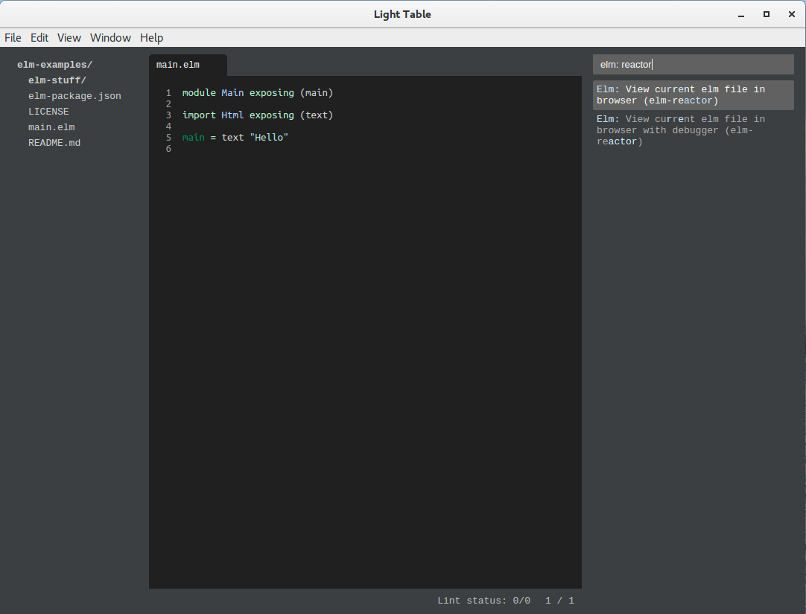
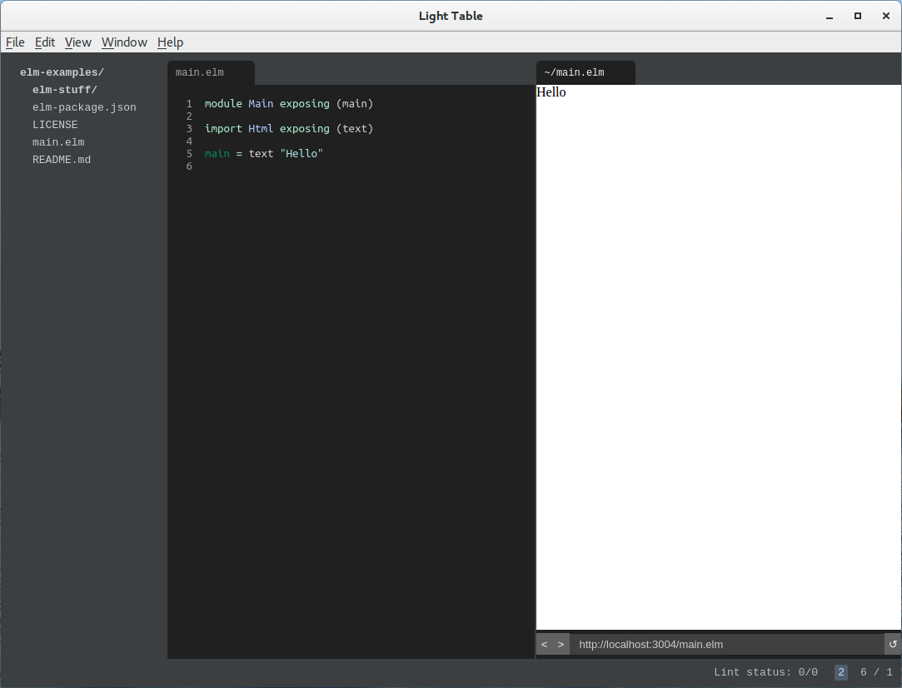
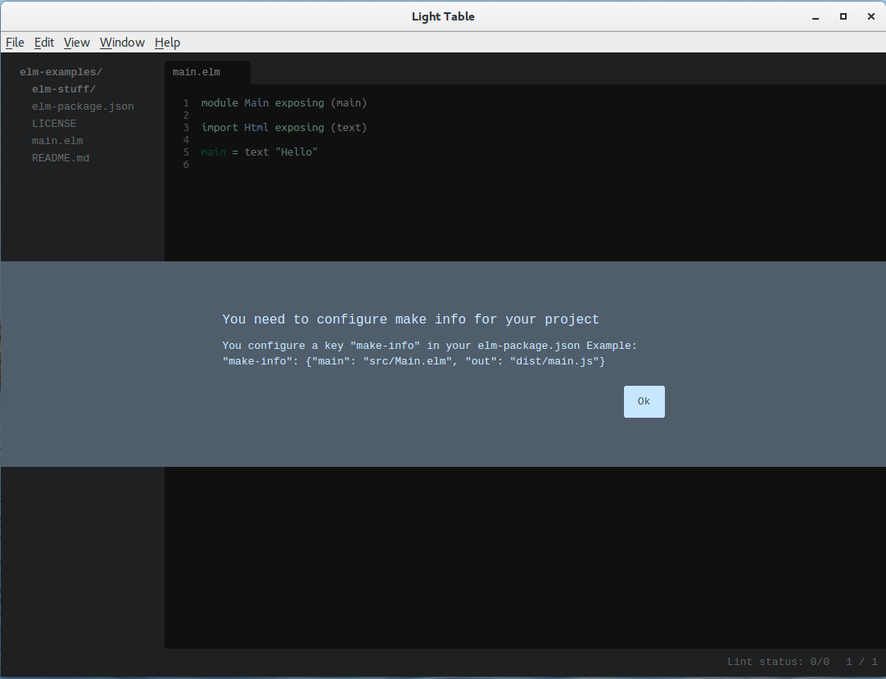
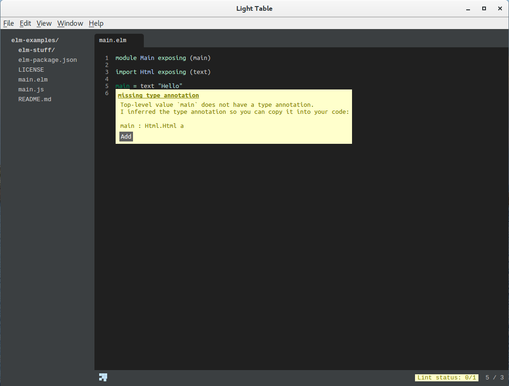
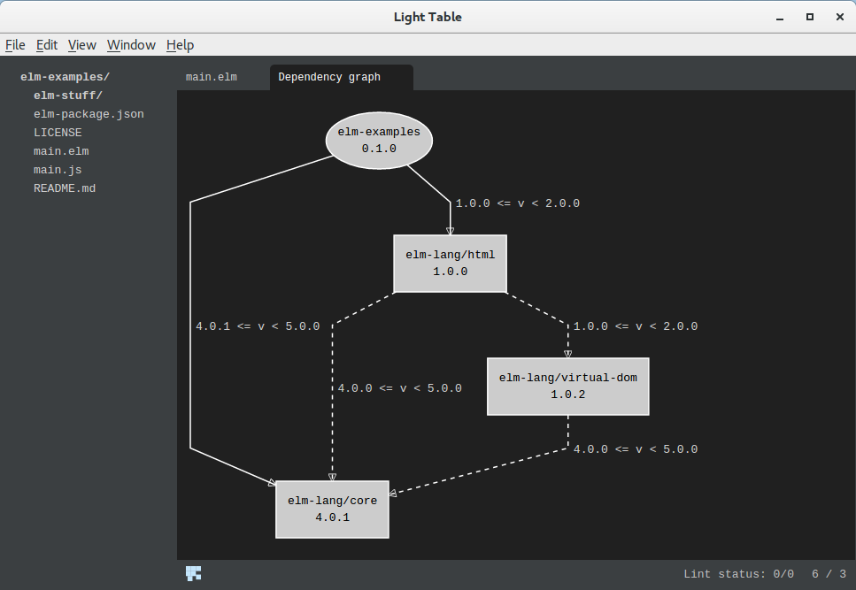
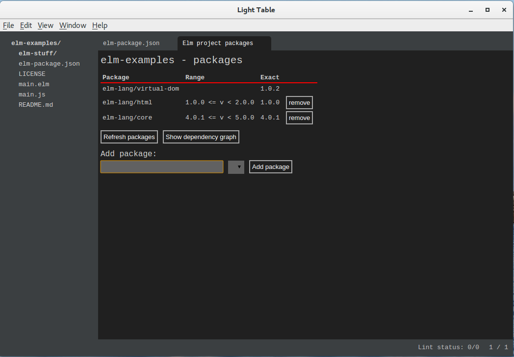
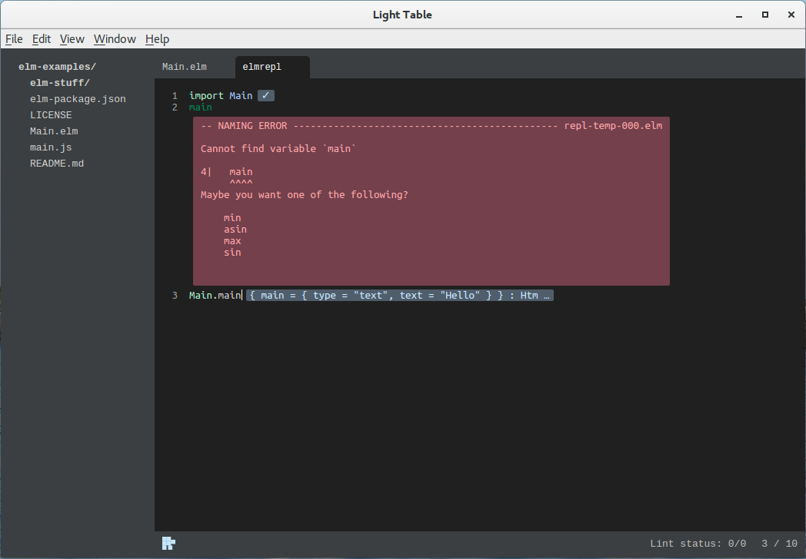

# Заметки о функциональном и логическом программировании

[[Перейти к оглавлению](README.md)]

## Инструментальные средства разработки на языке Elm

_Эта заметка базируется на статье автора, которая первоначально была опубликована
на [Habrahabr](https://habrahabr.ru/post/302154/), а затем, в доработанном виде, в
[блоге автора](https://easimonenko.bitbucket.io/#!notes/developers-tools-in-the-elm-language)._

[Elm](http://elm-lang.org) это функциональный язык программирования для
разработки веб-приложений, работающих в браузере. Elm строгий, статически
типизированный. Elm похож на Haskell, однако это лишь поверхностное сходство,
ведь Elm изначально заточен для быстрой разработки веб-приложений. Эта статья
представляет из себя шпаргалку для начинающих по основам разработки на языке
Elm, а именно, здесь рассматривается установка и настройка среды, организация
проекта, инструментарий Elm и среда разработки Light Table.

## Установка Elm

Elm можно установить как пакет [NPM](https://www.npmjs.com/):

``` bash
npm install -g elm
```

Это предпочтительный способ для веб-разработчика, так как большое количество
инструментария для веб-разработки работает на [Node.js](https://nodejs.org).

Пользователи Windows и MacOS могут пройти по
[ссылке](https://guide.elm-lang.org/install.html) и загрузить соответствующую
программу для установки Elm. Там же описывается состав инструментария Elm и
как с ним работать. Elm также можно собрать из исходных текстов, загрузив их
с [репозитория Git](https://github.com/elm-lang/elm-platform). Для сборки
потребуется установленный [Haskell Platform](https://www.haskell.org/platform/).

После установки Elm разработчик получает набор из следующих утилит
командной строки:

* `eml-make` -- компилятор Elm.
* `elm-repl` -- интерактивная среда Elm.
* `elm-reactor` -- веб-сервер с компиляцией кода Elm на лету.
* `elm-package` -- управление пакетами Elm.

## elm-repl

Утилита [`elm-repl`](https://github.com/elm-lang/elm-repl) позволяет
интерактивно экспериментировать с кодом на Elm. Для запуска нужно набрать в
командной строке:

``` bash
elm-repl
```

После чего получим сообщение о версии `elm-repl`, короткую подсказку и,
собственно, командную строку:

``` plain
---- elm-repl 0.18.0 -----------------------------------------------------------
 :help for help, :exit to exit, more at <https://github.com/elm-lang/elm-repl>
--------------------------------------------------------------------------------
>
```

Поэкспериментируем. (Во всех примерах ниже последняя строка является результатом
выполнения выражения, её вводить, естественно не нужно.)

``` elm
1 + 2
3 : number
```

``` elm
"A" ++ "B"
"AB" : String
```

``` elm
n = 10
10 : number
```

При вводе следующего примера обратный слеш информирует о продолжении ввода
на следующей строке, символ вертикальная черта является элементом интерфейса, и
его вводить не нужно.

``` elm
factorial n = \
|   if n == 0 then \
|     1 \
|   else \
|     n * factorial (n - 1)
<function> : number -> number1
```

``` elm
factorial n
3628800 : number
```

## Установка Light Table

Elm поддерживается в виде плагинов многими продвинутыми редакторами: Atom,
Visual Studio Code, Emacs, Brackets и другими. Но, пожалуй, самая продвинутая
среда для Elm доступна в [Light Table](http://lighttable.com/)
в виде соответствующего плагина. Домашняя страничка этого плагина:
[https://github.com/rundis/elm-light](https://github.com/rundis/elm-light).
Там же можно прочитать о его возможностях по разработке на Elm. Собственно,
Light Table можно загрузить, пройдя по
[ссылке](https://github.com/LightTable/LightTable/releases).

Для большего удобства можно также установить плагин терминала
[Terminal](https://github.com/alun/terminal). Для
его работы также потребуется установить
[butterfly](https://github.com/paradoxxxzero/butterfly):

``` bash
sudo apt install libssl-dev
pip3 install butterfly
```

После установки butterfly нужно добавить в `.profile` к переменной `PATH` путь
`~/.local/bin` и повторно зайти в систему.

## Установка пакета Html

Для разработки веб-приложения на Elm потребуется пакет Elm html. Для этого
переходим в каталог проекта (он может быть абсолютно пустым) и запускаем в нём
следующую команду:

``` bash
elm package install elm-lang/html
```

Во время установки `elm-package` предложит добавить информацию об этом пакете
в файл `elm-package.json`. Соглашаемся с этим (тем более, что плагин
Light Table для Elm определяет проект Elm по наличию этого файла). Затем он
сообщит нам, что нужно установить зависимости этого пакета. Тоже соглашаемся.
В результате получаем установленными три пакета: `elm-lang/core`,
`elm-lang/html` и `elm-lang/virtual-dom`. Пакеты устанавливаются в подкаталог
`elm-stuff`, который не обязательно сохранять в репозитории, что и прописано в
`.gitignore`. (.gitignore можно получить из соответствующего
[репозитория](https://github.com/github/gitignore) GitHub.)

## Открываем проект в Light Table

Теперь можно открыть проект в Light Table. Для этого запускаем сам редактор
(в Linux команда `light`, если каталог Light Table прописан в PATH) и идём в
`File/Open folder`, выбираем соответствующий каталог проекта.

## Правим elm-package.json

Файл elm-package.json в проекте на языке Elm играет такую же роль, как и
package.json в проектах на базе JavaScript.

После установки первого пакета мы получим elm-package.json примерно такого
содержания:

``` json
{
    "version": "1.0.0",
    "summary": "helpful summary of your project, less than 80 characters",
    "repository": "https://github.com/user/project.git",
    "license": "BSD3",
    "source-directories": [
        "."
    ],
    "exposed-modules": [],
    "dependencies": {
        "elm-lang/core": "4.0.1 <= v < 5.0.0",
        "elm-lang/html": "1.0.0 <= v < 2.0.0"
    },
    "elm-version": "0.17.0 <= v < 0.18.0"
}
```

Очевидно, что нужно отредактировать содержимое полей `version`, `summary` и
`repository`.

## Создание главного модуля

В корне проекта разместим главный модуль приложения. Например, такого содержания:

``` elm
module Main exposing (main)

import Html exposing (text)

main = text "Hello"
```

## Запуск приложения

Для запуска приложения нужно открыть окно команд редактора (`Ctrl-Space`) и
набрать `elm: reactor`. В появившемся списке выберем `Elm: View current elm
file in browser (elm-reactor)`.



После чего должно открыться окно встроенного
браузера с запущенным нашим приложением. Если видим пустое окно браузера, то
немного подождав, обновим его содержимое (`Ctrl-R`). Должны увидеть надпись
`Hello`.



Чтобы видеть окно браузера открытым рядом с окном редактора кода, нужно
вызвать контекстное меню окна браузера и выбрать пункт меню
`Move tab to new tabset`.

## Автообновление приложения

`elm-reactor` предназначен для облегчения разработки приложений на Elm.
Во-первых, он предоставляет статический веб-сервер для разрабатываемого
приложения. Во-вторых, он следит за изменениями проекта, пересобирает его
при появлении изменений и обновляет содержимое окна браузера. ~~Правда у автора
последняя функция почему-то не работала. Возможно из-за того, что плагин для
Elm ещё не был адаптирован для версии 0.17.0.~~ Эта функция в текущей версии
отключена, но можно воспользоваться сторонним инструментом
[elm-live](https://github.com/tomekwi/elm-live):

``` bash
elm-live Main.elm
```

`elm-live` устанавливается как пакет NPM:

``` bash
npm install -g elm-live
```

## Сборка проекта

Для сборки (компиляции) проекта или отдельного модуля нужно открыть окно команд
(`Ctrl-Space`), набрать `elm: make` и выбрать соответствующий пункт меню.

При первой попытке собрать весь проект возникнет такая проблема:



Откроем elm-package.json и отредактируем его соответствующим образом:

``` json
"make-info": {
  "main": "main.elm",
  "out": "main.js"
}
```

В командной строке нужно в каталоге проекта запустить команду:

``` bash
elm make
```

## Проверка модуля

Для проверки модуля нужно открыть соответствующий файл модуля, открыть окно
команд, набрать `elm: lint` и выбрать `Lint selected file`. После проверки
проблемные места в коде будут подчёркнуты. Чтобы посмотреть, что за проблемы,
нужно сначала поставить курсор на подчёркнутое место в коде, затем вновь
обратиться к окну команд и набрать `linter: show`. Возле проблемного места
появится всплывающее окно с комментарием.



Если нажать клавишу Enter или щёлкнуть на соответствующую кнопку в окне, можно
получить исправление проблемы.

Набрав в окне команд `linter:` можно увидеть и другие функции этого инструмента.

## Граф зависимостей

Для построения графа зависимостей нужно в окне команд набрать `elm: graph` и
выбрать пункт `Elm: Show dependency graph`.



## Управление пакетами

Для управления пакетами, как было уже сказано в самом начале, есть команда
`elm package`, но плагин для Light Table также предоставляет визуальное
средство управления пакетами проекта. Для этого как обычно открываем окно
команд, набираем в нём `elm: package` и выбираем пункт
`Elm: Show project packages`.



## REPL

REPL можно вызвать как из командной строки, запустив команду

``` bash
elm repl
```

Так и в среде Light Table. Для этого открываем окно команд, набираем в нём
`elm: repl` и выбираем пункт `Elm repl: Open a elm repl`.

Для запуска кода модуля в REPL нужно сначала модуль импортировать:

``` elm
import Main
```

После чего можно вызвать какую-нибудь функцию:

``` elm
Main.main
```

В REPL после ввода кода нужно нажимать `Ctrl-Enter`.



## Elmjutsu

[Elmjutsu](https://github.com/halohalospecial/atom-elmjutsu) -- плагин для
[Atom](https://atom.io/), предоставляющий автодополнение, навигацию по коду,
подсказки, управление пакетами и даже рефакторинг. Загрузить Atom можно,
пройдя по [ссылке](https://github.com/atom/atom/releases). Плагин Elmjutsu
устанавливается в среде Atom очевидным способом. Перед установкой Elmjutsu нужно
установить плагин _language-elm_. Рекомендуется также установить плагины
_hyperclick_, _linter-elm-make_ и _elm-format_.

## elm-format

Для удобства форматирования кода на Elm настоятельно рекомендуется установить
[elm-format](https://github.com/avh4/elm-format). Загрузить последнюю версию
можно, пройдя по [ссылке](https://github.com/avh4/elm-format/releases). Многие
среды разработки позволяют задать автоформатирование кода с помощью комбинации
клавиш или перед сохранением кода.

Кроме облегчения форматирования кода _elm-format_ позволяет поддерживать код в
единообразном стиле.

## Что дальше

* начало: [http://elm-lang.org/get-started](http://elm-lang.org/get-started)
* руководство: [http://guide.elm-lang.org/index.html](http://guide.elm-lang.org/index.html)
* примеры: [http://elm-lang.org/examples/](http://elm-lang.org/examples/)
* пакеты: [http://package.elm-lang.org/](http://package.elm-lang.org/)
* интерактивная разработка: [http://elm-lang.org/blog/interactive-programming](http://elm-lang.org/blog/interactive-programming)
* отладка: [http://debug.elm-lang.org/](http://debug.elm-lang.org/)
* русскоязычное сообщество: [https://vk.com/elm_lang_ru](https://vk.com/elm_lang_ru)

[[Перейти к оглавлению](README.md)]

---

&copy; [Евгений А. Симоненко](LICENSE.md), 2016-2017
